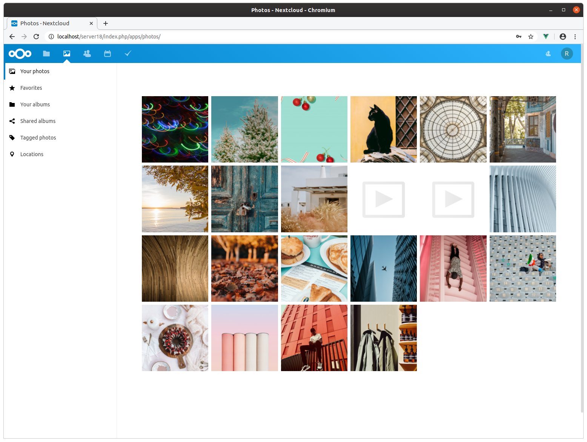

<!--
  - SPDX-FileCopyrightText: 2016-2024 Nextcloud GmbH and Nextcloud contributors
  - SPDX-License-Identifier: CC0-1.0
-->
# Nextcloud Photos

**📸 Your memories under your control**

## Why is this so awesome?

* **📸 Beautiful Photo and Video Timeline**
* **⭐ Favorites and Tagging:** Favorite and tag your photos!
* **Slideshow and easy sharing:** Show slideshows and share your photos or albums easily
* **Albums:** Create albums from your contents

## 🚀 Installation

In your Nextcloud, simply enable the Photos app through the Apps management.
The Nextcloud Photos app is included in Nextcloud 18 and higher.

Optional add-ons that make the Photos app even better:

* Install [Recognize for Nextcloud](https://github.com/nextcloud/recognize) for AI-powered automatic face and object recognition. Includes automated tagging/categorizing.
* Install the [preview generator](https://github.com/rullzer/previewgenerator) if pre-generating thumbnails is desired.
* Install [Imaginary](https://docs.nextcloud.com/server/latest/admin_manual/installation/server_tuning.html#previews) to speed up preview generation.

## Mobile Photos

Use the Android/iOS App to view your photos. It's possible to auto-upload them.

## Maintainers

* [John Molakvoæ](https://github.com/skjnldsv)

If you'd like to join, just go through the [issues list](https://github.com/nextcloud/photos/issues) and fix some!

## 🏗 Development setup

This app requires the [Viewer app](https://github.com/nextcloud/viewer) to be installed and enabled.
Follow its development setup and then continue here.

1. ☁ Clone this into your `apps` folder of your Nextcloud.
1. 👩‍💻 In a terminal, run the command `make dev-setup` to install the dependencies.
1. 🏗 Then to build the Javascript whenever you make changes, run `make build-js`. To create a pull request use `make build-js-production`. Watch changes with: `make watch-js`.
1. ✅ Enable the app through the app management of your Nextcloud.
1. 🎉 Partytime!
1. 💻 Fix easily linting issues with `npm run lint:fix`.

